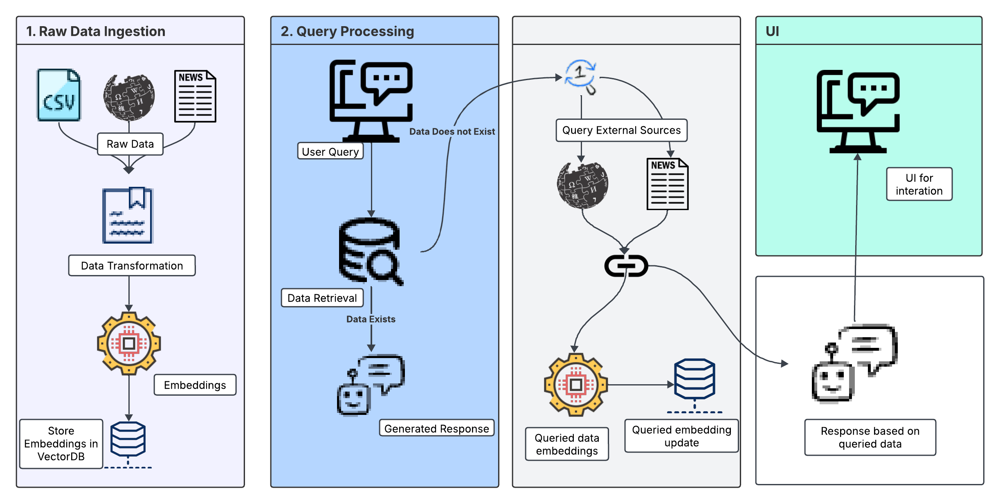

# Technical Design Document for Restaurant Chatbot

---

## Introduction
This document provides a high-level view of the Restaurant Chatbot’s technical workflow, as depicted in the flowchart above. It highlights how **raw data** is ingested, how **user queries** are processed to retrieve information from internal and external sources, and how the **UI** presents the final response.

---

## 1. Raw Data Ingestion

1. **CSV and Other Data Sources**  
   - **Structured Data (CSV)**: The chatbot accepts CSV files containing restaurant data, including menu items, descriptions, ingredients, etc.  
   - **Unstructured Data (External Sources)**: Additional text-based information (e.g., from websites or news) may be introduced to augment the local dataset.

2. **Data Transformation**  
   - **Preprocessing**: Cleans and normalizes input text (e.g., data mapping, adding metadata, correcting encodings).  
   - **Chunking**: Splits large blocks of text (menu descriptions, articles, etc.) into smaller chunks for more efficient embedding.

3. **Embeddings & Vector Database**  
   - **Embedding Generation**: Each chunk of text is converted into numerical embeddings (using Sentence Transformers or a similar model).  
   - **Storage in VectorDB**: These embeddings are indexed and stored in a **FAISS** (or other) vector database for speedy similarity-based retrieval.

---

## 2. Query Processing

1. **User Query Entry**  
   - The user enters a query through the chatbot interface (e.g., “What vegan dishes are popular in New York restaurants?”).

2. **Data Retrieval**  
   - **Check VectorDB**: If relevant data is found in the local embeddings, retrieve the matching chunks.  
   - **Does Data Exist?**  
     - **Yes**: A draft response is generated using the retrieved local data.  
     - **No**: If the system determines more information is needed (e.g., ingredient or historical data not in the local store), it makes an **external API** call (Wikipedia, news, etc.) to fetch additional content.  
   - **Embedding Update**: Newly fetched external text is embedded and added to the VectorDB for future use.

3. **Response Generation**  
   - **LLM Integration**: A pre-trained language model (like Mistral, GPT, etc.) processes the query context and retrieved data.  
   - **Answer Construction**: The LLM generates a structured response, referencing relevant portions of local or external text.

---

## 3. UI

1. **User Interaction**  
   - The chatbot is served via **Streamlit** or a similar framework, providing a clean, interactive user interface.  
   - Users can **upload CSV files**, submit queries, and view conversation history.

2. **Response Delivery**  
   - **Display Results**: The chatbot presents the LLM-generated response.  
   - **Follow-up Queries**: Users can continue the conversation, refine their search, or ask additional questions, triggering new retrieval and generation cycles.

---

## Summary
This workflow ensures:
- **Efficient Data Handling**: Raw data is preprocessed and embedded for quick retrieval.  
- **Dynamic Query Fulfillment**: The chatbot checks its local store first, then fetches external data on demand.  
- **Enhanced User Experience**: A simple, interactive UI with real-time query-and-response functionality.

By combining **FAISS** for high-speed retrieval, **LLM** integrations for natural language understanding, and a straightforward user interface, the Restaurant Chatbot seamlessly delivers detailed, context-rich answers about restaurant menus and culinary trends.

---
